# Ralph PRD Architecture Diagram

## Overview: Coordinator + Task Agent Pattern

```mermaid
flowchart TD
    Start([User runs /ralph-prd-loop]) --> Init[Initialize Coordinator]
    Init --> ReadPRD[Read prd.json]
    ReadPRD --> CheckComplete{All stories<br/>passes: true?}

    CheckComplete -->|Yes| Done([🎉 All Done!])
    CheckComplete -->|No| FindNext[Find highest priority<br/>story with passes: false]

    FindNext --> SpawnTask[Spawn Fresh Task Agent<br/>~150k token context]

    SpawnTask --> TaskAgent[Task Agent Executes]

    subgraph TaskAgent ["🔄 Task Agent (Fresh Context)"]
        T1[Read prd.json] --> T2[Read progress.jsonl<br/>learnings]
        T2 --> T3[Implement ONE story]
        T3 --> T4[Run quality checks<br/>typecheck, tests, lint]
        T4 --> T5{Checks pass?}
        T5 -->|No, retry < 3| T3
        T5 -->|No, retries exhausted| TFail[Report failure<br/>Exit]
        T5 -->|Yes| T6[Git commit]
        T6 --> T7[Update prd.json<br/>passes: true]
        T7 --> T8[Append to<br/>progress.jsonl]
        T8 --> TExit[Exit<br/>Context discarded ♻️]
    end

    TExit --> CoordCheck{Story marked<br/>passes: true?}
    CoordCheck -->|Yes| LogSuccess[Log story_completed event]
    CoordCheck -->|No| LogFail[Log story_failed event<br/>Stop loop]

    LogSuccess --> CheckIter{iteration &lt;<br/>max_iterations?}
    CheckIter -->|Yes| ReadPRD
    CheckIter -->|No| MaxReached([🛑 Max iterations reached])

    LogFail --> UserFix([❌ User must intervene])

    style SpawnTask fill:#e1f5ff
    style TaskAgent fill:#fff4e1
    style TExit fill:#ffe1e1
    style Done fill:#e1ffe1
    style UserFix fill:#ffe1e1
    style MaxReached fill:#ffe1e1
```

## Memory & State Management

```mermaid
flowchart LR
    subgraph Memory ["💾 Persistent Memory (Survives Task Agent Exit)"]
        Git[(Git Commits<br/>Code ground truth)]
        PRD[(prd.json<br/>Story status)]
        Progress[(progress.jsonl<br/>Learnings)]
    end

    subgraph Coord ["👨‍✈️ Coordinator Agent"]
        C1[Minimal context<br/>~10k tokens]
        C2[Reads state files]
        C3[Spawns Task agents]
    end

    subgraph Task1 ["🤖 Task Agent 1<br/>US-001"]
        TA1[Fresh 150k context]
        TA1Read[Reads Memory]
        TA1Impl[Implements story]
        TA1Write[Updates Memory]
        TA1Exit[Exits ♻️]
    end

    subgraph Task2 ["🤖 Task Agent 2<br/>US-002"]
        TA2[Fresh 150k context]
        TA2Read[Reads Memory]
        TA2Impl[Implements story]
        TA2Write[Updates Memory]
        TA2Exit[Exits ♻️]
    end

    Coord --> |spawns| Task1
    Task1 --> |reads| Memory
    Task1 --> |writes| Memory
    Task1 --> |exits| Coord

    Coord --> |spawns| Task2
    Task2 --> |reads| Memory
    Task2 --> |writes| Memory
    Task2 --> |exits| Coord

    style Memory fill:#e1ffe1
    style Coord fill:#e1f5ff
    style Task1 fill:#fff4e1
    style Task2 fill:#fff4e1
    style TA1Exit fill:#ffe1e1
    style TA2Exit fill:#ffe1e1
```

## Context Comparison: Old vs New

```mermaid
flowchart TB
    subgraph Old ["❌ OLD: Single Session (Stop Hook Pattern)"]
        O1[Iteration 1<br/>Story US-001<br/>Context: 20k tokens] --> O2[Iteration 2<br/>Story US-002<br/>Context: 45k tokens]
        O2 --> O3[Iteration 3<br/>Story US-003<br/>Context: 75k tokens]
        O3 --> O4[Iteration 10<br/>Story US-010<br/>Context: 140k tokens ⚠️]
        O4 --> O5[Iteration 20<br/>Story US-020<br/>Context: EXHAUSTED ❌]
    end

    subgraph New ["✅ NEW: Fresh Task Agents"]
        N1[Task Agent 1<br/>Story US-001<br/>Context: 150k tokens] -.exits.-> NC1[Coordinator]
        NC1 --> N2[Task Agent 2<br/>Story US-002<br/>Context: 150k tokens]
        N2 -.exits.-> NC2[Coordinator]
        NC2 --> N3[Task Agent 3<br/>Story US-003<br/>Context: 150k tokens]
        N3 -.exits.-> NC3[Coordinator]
        NC3 --> N4[Task Agent 50<br/>Story US-050<br/>Context: 150k tokens ✅]
    end

    style Old fill:#ffe1e1
    style New fill:#e1ffe1
    style O5 fill:#ff0000,color:#fff
    style N4 fill:#00ff00
```

## Event Flow

```mermaid
sequenceDiagram
    participant User
    participant Coordinator
    participant TaskAgent1 as Task Agent 1<br/>(US-001)
    participant TaskAgent2 as Task Agent 2<br/>(US-002)
    participant Files as prd.json<br/>progress.jsonl<br/>Git

    User->>Coordinator: /ralph-prd-loop
    Coordinator->>Coordinator: Initialize<br/>Log loop_started event

    Coordinator->>Files: Read prd.json
    Files-->>Coordinator: US-001 incomplete

    Coordinator->>Coordinator: Log story_started event
    Coordinator->>TaskAgent1: Spawn (fresh 150k context)

    TaskAgent1->>Files: Read prd.json, progress.jsonl
    TaskAgent1->>TaskAgent1: Implement US-001
    TaskAgent1->>TaskAgent1: Run typecheck, tests
    TaskAgent1->>Files: Git commit
    TaskAgent1->>Files: Update prd.json (passes: true)
    TaskAgent1->>Files: Append to progress.jsonl
    TaskAgent1-->>Coordinator: Exit (context discarded)

    Coordinator->>Coordinator: Log story_completed event
    Coordinator->>Files: Read prd.json
    Files-->>Coordinator: US-002 incomplete

    Coordinator->>Coordinator: Log story_started event
    Coordinator->>TaskAgent2: Spawn (fresh 150k context)

    TaskAgent2->>Files: Read prd.json, progress.jsonl<br/>(sees US-001 learnings)
    TaskAgent2->>TaskAgent2: Implement US-002
    TaskAgent2->>TaskAgent2: Run typecheck, tests
    TaskAgent2->>Files: Git commit
    TaskAgent2->>Files: Update prd.json (passes: true)
    TaskAgent2->>Files: Append to progress.jsonl
    TaskAgent2-->>Coordinator: Exit (context discarded)

    Coordinator->>Coordinator: Log loop_completed event
    Coordinator-->>User: ✅ All stories complete!
```

## Key Architectural Principles

## Comparison to Snarktank Ralph

